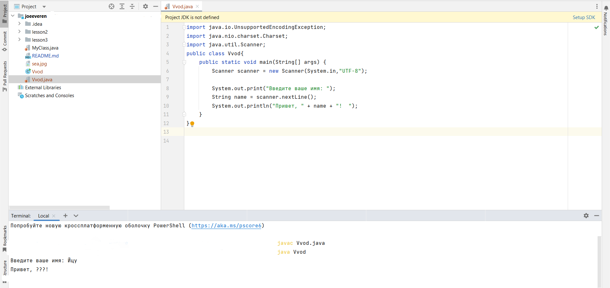
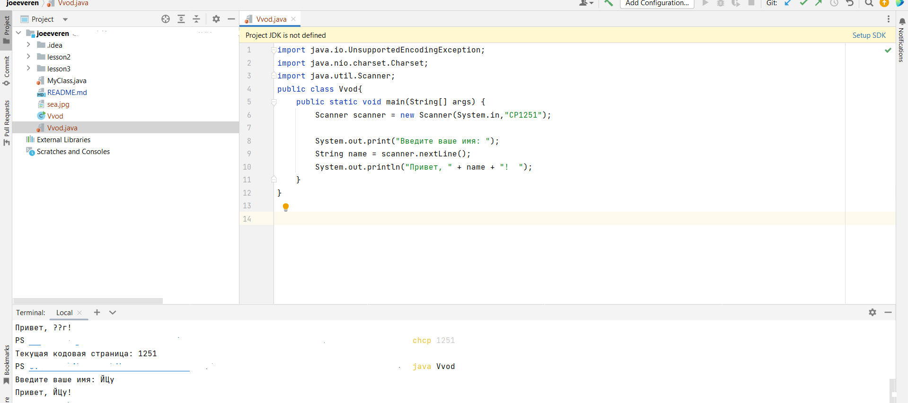

## Java в командной строке
---
#####Отчет по выводу

Код ввода вывода записан  [тут ](Vvod.java)

При использовании UTF - 8 не отображался вводимый текст. Можно посмотреть на скрине 



Для правильного отображения пришлось писать в терминале
```
 chcp 1251 
  ```
И в коде его же и выбирать. На скрине видно что это сработало
